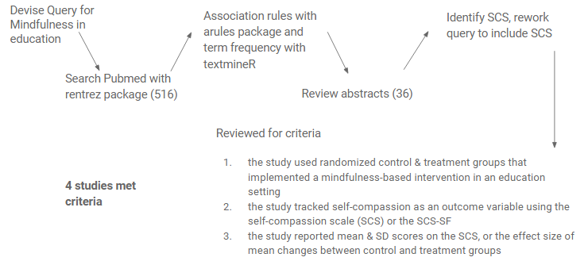
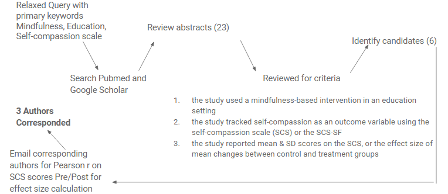

```{r setup, include=FALSE}
knitr::opts_chunk$set(echo = F, message = F, warning = F, cache = T, fig.align = 'center', fig.height = 5, fig.width = 7.5, tidy = T, tidy.opts = list(width.cutoff = 80))
options(scipen = 12)
# Make reproducible
set.seed(1)
# Install packages
pkgs <- c("tidyverse","htmltools","magrittr", "metafor", "HDA", "extrafont")
new.pkgs  <- pkgs[!(pkgs %in% installed.packages()[,"Package"])]
if (length(new.packages) & any("HDA" %in% new.pkgs)) {
  devtools::install_github("yogat3ch/HDA")
  new.pkgs <- new.pkgs[!new.pkgs %in% "HDA"]
  }
if (length(new.pkgs)) {
  install.packages(new.pkgs)
  .rs.restartR()
  }
# Load packages
HDA::startPkgs(pkgs)
```
```{r 'Source', results='hide'}
source("Meta-Analysis.R", echo = F)
```

# Abstract

**Introduction:** The experience of the academic environment can be competitive, stressful, and at times overwhelming for students and faculty alike. Self-compassion, defined by Kristen Neff PhD as including self-kindness, common humanity, and mindfulness, has been associated with general resourcefulness, self-regulation, and well-being in university students, but mindfulness practices evoking self-compassion remain underutilized in academic contexts. **Methods:** This meta-analysis evaluated five studies and seeks to establish associations between the characteristics of mindfulness-based interventions in educational contexts, namely contact time, individual time (outside of the group context), type of intervention (Mindfulness-based stress reduction or Self-compassion courses) and their influence on the between-group (treatment-control) and within-group (pre-post) standardized mean differences (SMD) of scores on the Self-compassion scale. **Results:** The SMDs across four studies where treatment & control groups were evaluated, ranged from `r  paste0(round(range(Studies$Results$CT$General[["yi"]]), 2), collapse = "-")` while SMDs across three studies where pre/post treatment scores were evaluated ranged from `r Studies$Results$TT$General$yi %>% range %>% round(2) %>% paste0(collapse = "-")`, $\mu = `r mean(Studies$Results$TT$General$yi) %>% round(2)`$.  Intervention type, in both pre/post and treatment/control analyses showed the largest significant effect $\beta= 1.14$, $p \leq 0.1$ on self-compassion outcome measures. **Conclusion:** Two to eight-week mindfulness courses embedded within coursework can have a significant effect on self-compassion scores for student cohorts.

# Introduction
- Self-compassion is a state of “loving, connected presence.” It is linked to positive states of the mind and overall well-being. Self-compassion has gained popularity in the West in part due to an alarming rise in psychological unwellness related to stress, anxiety, and depression. 
- According to the APA, 41.6% to 63% of college students report anxiety, 36.4% depression, and 35.8% relational difficulties (APA, 2013).
- College students fact a unique set of stressors: moving out of their home and no longer living with the family, not having enough social support, being presented with many career choices, increased ambitions, coursework demands, unhealthy ways of coping with stress including substance use and sex, competition, and the impending doom of student loan debt.
- College students also largely do not rely on healthy coping strategies to deal with stress. 
- In higher educational settings, failings are unavoidable, since learning itself presents a series of trial, error, growth, experimentation, testing boundaries, and putting yourself in uncomfortable situations. One can argue that self-regulation in a form of being able to pick yourself up, kindly and with understanding, is a useful prevention tool for short- and long-term physical and mental wellness. 
- Self-compassion is associated with increased well-being in first year university students and decreased decline in well-being over the course of the college career (Gunnell et al., 2017), reduced procrastination (n = 200; Loona & Khan, 2016); and is positively correlated with emotional intelligence (n = 571; Şenyuva et al., 2014).

Two research questions for this study are: (1) what effect do mindfulness-based interventions applied in education settings have on the construct of self-compassion, and (2) what is the degree of effectiveness of changing self-compassion, given interventions’ duration, type, and contact time?


# Methods
### Method for Control - Treatment Model


```{r 'CT Design', echo=F}

CT_Table %>%
  dplyr::select(- `Inperson/Online`) %>% 
kableExtra::kable(format = "html") %>% kableExtra::kable_styling(bootstrap_options = "striped", full_width = T, position = "center", font_size = 12) %>%
  kableExtra::column_spec(column = c(5), border_left = T, border_right = F) %>% 
  kableExtra::column_spec(column = 6, border_right = T) %>% 
  kableExtra::column_spec(column = 7, border_right = T) %>% 
  kableExtra::column_spec(column = 8, border_right = T) %>% 
  kableExtra::column_spec(column = 13, bold = T) %>%
  kableExtra::row_spec(row = 0, font_size = 16)
```

### Method for Pre/Post Treatment Model


```{r 'TT Design', echo=F}
TT_Table %>%
  dplyr::select(- `Inperson/Online`) %>% 
kableExtra::kable(format = "html") %>% kableExtra::kable_styling(bootstrap_options = "striped", full_width = T, position = "center", font_size = 12) %>%
  kableExtra::column_spec(column = c(5), border_left = T, border_right = F) %>% 
  kableExtra::column_spec(column = 6, border_right = T) %>% 
  kableExtra::column_spec(column = 7, border_right = T) %>% 
  kableExtra::column_spec(column = 8, border_right = T) %>% 
  kableExtra::column_spec(column = 13, bold = T) %>%
  kableExtra::row_spec(row = 0, font_size = 16)
```
<!-- <iframe src="https://docs.google.com/spreadsheets/d/e/2PACX-1vS962Ys563I18H36KQWR2lg7l2wQbkh8Bkt-Ib0ler7ABdyIjA7wH8qgjSYj-SCE0Sn2wcm_HBEsgQY/pubhtml?gid=2047158368&amp;single=true&amp;widget=false&amp;chrome=false&amp;headers=false&amp;range=A1:N5" width="100%" height = "300px"></iframe> -->


# Results

Usually you want to have a nice table displaying some important results that you have calculated. In `posterdown` this is as easy as using the `kable` table formatting you are probably use to as per typical R Markdown formatting.

You can reference tables like so: Table \@ref(tab:mytable). Lorem ipsum dolor sit amet, consectetur adipiscing elit. Aliquam placerat augue at velit tincidunt semper. Donec elementum porta posuere. Nullam interdum, odio at tincidunt feugiat, turpis nisi blandit eros, eu posuere risus felis non quam. Nam eget lorem odio. Duis et aliquet orci. Phasellus nec viverra est.


Or with figures: Figure \@ref(fig:standard-plot), or Figure \@ref(fig:morefigs).

# Conclusion

- Full length and brief mindfulness-based interventions for students in educational settings show large improvements in self-compassion as measured by the Self-Compassion scale. 
- Interventions with less total contact time show similar effect sizes to interventions with markedly more contact time. 
- The Self-compassion course showed the most significant effect size on the self-compassion scale.


# Limitations

- Small number of studies (N = 239)
- Self-report and no objective/phisiological measures of stress

# Next Steps 
- Future studies might examine qualitative as well as quantitative outcome measures more relevant to the educational setting. Outcome measures might be a quantifiable metric of distractibility, or it’s opposite: focused attention, prosociality, classroom performance, empathy, compassion (for others), or altruism.
- Future studies need to include third-person reports of behavioral or performance measures as well as machine measurable, quantifiable outcomes in order to provide a more objective view of the outcomes participants are able to realize by participating in mindfulness-based interventions in educational settings. 

# References
```{r, include=FALSE}
knitr::write_bib(pkgs, 'packages.bib')
```