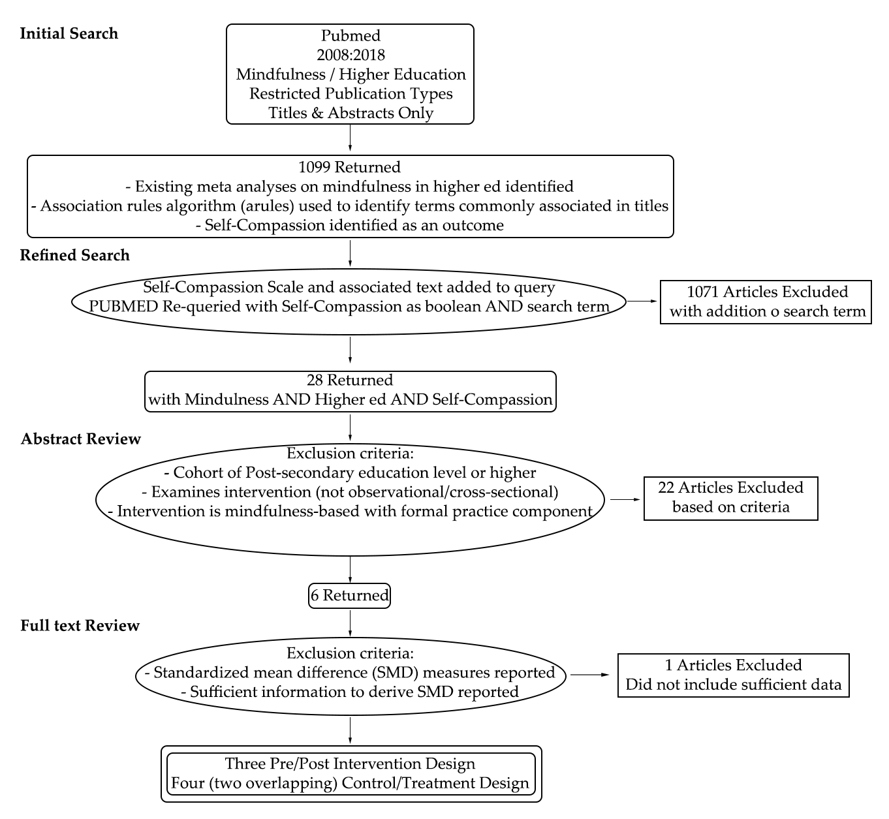

```{r setup, include=FALSE}
knitr::opts_chunk$set(echo = F, message = F, warning = F, cache = T, fig.align = 'center', fig.height = 5, fig.width = 7.5, tidy = T, tidy.opts = list(width.cutoff = 80))
options(scipen = 12)
# Make reproducible
set.seed(1)
# Install packages
 pkgs <- c("tidyverse","htmltools","magrittr", "metafor", "HDA", "extrafont")
# new.pkgs  <- pkgs[!(pkgs %in% installed.packages()[,"Package"])]
# if (length(new.pkgs) & any("HDA" %in% new.pkgs)) {
#   devtools::install_github("yogat3ch/HDA")
#   new.pkgs <- new.pkgs[!new.pkgs %in% "HDA"]
#   }
# if (length(new.pkgs)) {
#   install.packages(new.pkgs)
#   .rs.restartR()
#   }
# Load packages
HDA::startPkgs(pkgs)
```
```{r 'Source', results='hide'}
source("Meta-Analysis.R", echo = F)

```

<link rel="stylesheet" href="pd.css">


# Abstract

**Introduction:** The experience of the academic environment can be competitive, stressful, and at times overwhelming for students and faculty alike. Self-compassion, defined by Kristen Neff PhD as including self-kindness, common humanity, and mindfulness, has been associated with general resourcefulness, self-regulation, and well-being in university students, but mindfulness practices evoking self-compassion remain underutilized in academic contexts. **Methods:** This meta-analysis evaluated five studies and seeks to establish associations between the characteristics of mindfulness-based interventions in educational contexts, namely contact time, individual time (outside of the group context), type of intervention (Mindfulness-based stress reduction or Self-compassion courses) and their influence on the between-group (treatment-control) and within-group (pre-post) standardized mean differences (SMD) of scores on the Self-compassion Scale. **Results:** The SMDs across four studies where treatment & control groups were evaluated, ranged from `r  paste0(round(range(Studies$Results$CT$General[["yi"]]), 2), collapse = "-")` while SMDs across three studies where pre/post treatment scores were evaluated ranged from `r Studies$Results$TT$General$yi %>% range %>% round(2) %>% paste0(collapse = "-")`.  In the control/treatment design, `r purrr::imap_chr(Studies$Results$TT[2:4], ~{
  if(.y == "Type") .y <- "Intervention Type" else if (.y == "Time") .y <- "Contact Time"
  paste0(.y, " (p=", purrr::pluck(.x, "QMp") %>% round(2),")")  
})  %>% {paste0(paste(.[1:2], collapse = ", "), " and ",.[3])}` were all significant predictors of self-compassion. In the Pre/Post treatment design  (suited for ad-hoc semester-long class cohort studies),  `r purrr::imap_chr(Studies$Results$CT[2:4], ~{
  if(.y == "Type") .y <- "Intervention Type" else if (.y == "Time") .y <- "Contact Time"
  paste0(.y, " (p=", purrr::pluck(.x, "QMp") %>% round(3),")")  
})  %>% {paste0(paste(.[1:2], collapse = " and "), " were significant predictors while ",.[3])}` was not. In both study designs; Intervention type, specifically interventions modeled after the Self-Compassion Course, was the most influential factor effecting self-compassion outcomes (C/T: $\beta= `r Studies$Results$CT$Type$beta[2 ,1] %>% round(2)`$ P/P: $\beta= `r Studies$Results$TT$Type$beta[2 ,1] %>% round(2)`$) on self-compassion outcome measures. **Conclusion:** Two to eight-week mindfulness courses embedded within coursework can have a significant effect on self-compassion scores for student cohorts.

# Introduction
### Research Questions
<ol>
<li>What effect do mindfulness-based interventions applied in education settings have on the construct of self-compassion?</li>
<li>What aspects of a mindfulness-based intervention exert the greatest influence on self-compassion: course duration, type, or total contact time?</li>
</ol>
 
- Self-compassion is a state of “loving, connected presence.” It is linked to positive states of mind and overall well-being. Self-compassion has gained popularity in the West in part due to an alarming rise in psychological unwellness related to stress, anxiety, and depression. 
- According to the APA, 41.6% to 63% of college students report anxiety, 36.4% depression, and 35.8% relational difficulties (APA, 2013).
- College students have a unique set of stressors: moving out of their home and no longer living with family, limited social support, many career choices, increased ambitions, competition, coursework demands, unhealthy ways of coping with stress including substance use and sex, and often looming student loan debt.
- In higher educational settings, failings are unavoidable, since learning itself presents a series of trial, error, growth, experimentation, testing boundaries, and putting oneself in uncomfortable situations. One can argue that self-regulation in a form of being able to pick yourself up, kindly and with understanding, as a useful prevention tool for short- and long-term physical and mental wellness. 
- Self-compassion is associated with increased well-being in first year university students and decreased decline in well-being over the course of the college career (Gunnell et al., 2017), reduced procrastination (n = 200; Loona & Khan, 2016); and is positively correlated with emotional intelligence (n = 571; Şenyuva et al., 2014).

# Methods


### Design for Control - Treatment Model
```{r 'CT Design', echo=F}

CT_Table %>%
  dplyr::select(- `Inperson/Online`) %>% 
kableExtra::kable(format = "html") %>% kableExtra::kable_styling(bootstrap_options = "striped", full_width = T, position = "center", font_size = 13) %>%
  kableExtra::column_spec(column = c(5), border_left = T, border_right = F) %>% 
  kableExtra::column_spec(column = 6, border_right = T) %>% 
  kableExtra::column_spec(column = 7, border_right = T) %>% 
  kableExtra::column_spec(column = 8, border_right = T) %>% 
  kableExtra::column_spec(column = 13, bold = T) %>%
  kableExtra::row_spec(row = 0, font_size = 15)
```

### Design for Pre/Post Treatment Model
```{r 'TT Design', echo=F}
TT_Table %>%
  dplyr::select(- `Inperson/Online`) %>% 
kableExtra::kable(format = "html") %>% kableExtra::kable_styling(bootstrap_options = "striped", full_width = T, position = "center", font_size = 13) %>%
  kableExtra::column_spec(column = c(5), border_left = T, border_right = F) %>% 
  kableExtra::column_spec(column = 6, border_right = T) %>% 
  kableExtra::column_spec(column = 7, border_right = T) %>% 
  kableExtra::column_spec(column = 8, border_right = T) %>% 
  kableExtra::column_spec(column = 13, bold = T) %>%
  kableExtra::row_spec(row = 0, font_size = 15)
```

# Results
<table style="width=100%">
<tbody>
<tr>
<td>
<h3 class="text-center">Control-Treatment</h3>
</td>
<td>
<h3 class="text-center">Pre/Post</h3>
</td>
</tr>
<tr>
<td>

```{r 'CT Plots'}
.pngs <- c("CTMod Contact Time & Individual Time.pdf", "CTMod Duration in Weeks.pdf", "CTMod Intervention Type.pdf")  %>% 
purrr::map_chr(~ {
  magick::image_read_pdf(.x) %>%  magick::image_scale(geometry = magick::geometry_size_pixels(width = 1336 / 2, preserve_aspect = T)) %>% {magick::image_write(., path = stringr::str_replace(.x, "\\.pdf$", ".png"))}
  
})

knitr::include_graphics(.pngs, dpi = NA)
```  
</td>
<td>
  
```{r 'TT Plots'}
.pngs <- c("TTMod Contact Time & Individual Time.pdf", "TTMod Duration in Weeks.pdf", "TTMod Intervention Type.pdf")  %>% 
purrr::map_chr(~ {
  magick::image_read_pdf(.x) %>%  magick::image_scale(geometry = magick::geometry_size_pixels(width = 1336 / 2, preserve_aspect = T)) %>% {magick::image_write(., path = stringr::str_replace(.x, "\\.pdf$", ".png"))}
  
})

knitr::include_graphics(.pngs, dpi = NA)
```
</td>
</tr>
</tbody>
</table>

# Conclusion
- Full length and brief mindfulness-based interventions for students in educational settings show large improvements in self-compassion as measured by the Self-compassion Scale. 
- Interventions with less total contact time and duration show similar effect sizes to interventions with markedly more contact time and of longer duration. 
- Inteventions modeled after the Self-compassion course showed the most significant effect size on the Self-compassion Scale.

# Limitations
- Small number of studies (C/T: 4 Studies, N = `r Studies$CT %>% purrr::map(purrr::pluck, "N") %>% unlist %>% sum`, P/P: 3 Studies, N = `r Studies$TT %>% purrr::map(purrr::pluck, "N") %>% unlist %>% sum`)
- Relationship between the Self-compassion construct and objective/physiological measures of stress is correlative.

# Next Steps 
- Future studies might examine comparisons between outcomes on the Self-compassion Scale and physiological biometric markers of stress, attention or distractibility. 
- Future studies can increase the validity of evidence by including third-person reports of psychological, behavioral and performance measures to provide a more objective view of the outcomes participants are able to realize by participating in mindfulness-based interventions in educational settings. 
